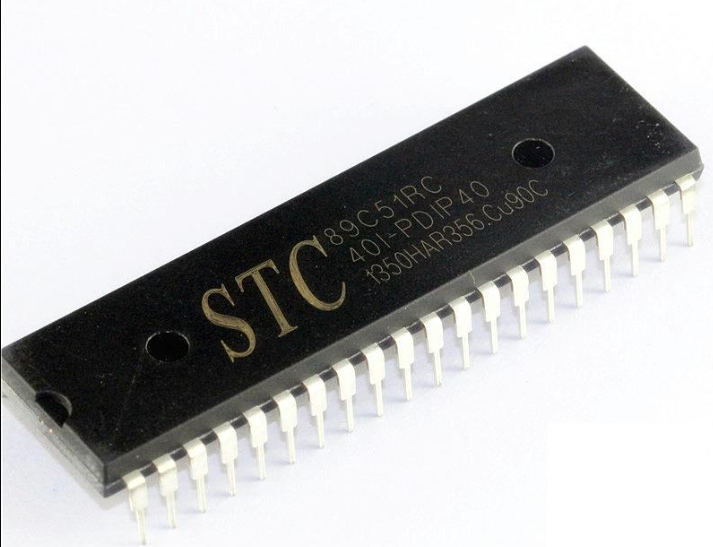

# TinyTask51
这是个极其简单的基于 STC89C51 的实时任务调度器，其运行原理很简单，就是用了中断和SP寄存器的一些特性。该库很小巧，可以实现实时多任务调度。目前计划支持基于时间片轮转法和任务自身调度法两种调度机制。
## 注意
本项目是为了个人搞研究，目标是为了研究操作系统调度技术。可能具备学习作用，但是不具备实际生产力。仅仅作为科研玩具吧。

## 支持平台
目前暂时只适配了以下MCU：
- STC89C51RC




- STC89C52RC


STC51/52对于本项目学习来说已经完全足够了。
## 特性

1. 最大支持**16**个任务，主要考虑到51的ROM比较小，这个16是个折中的数字，实际上经过计算，可以支持大概30个任务左右，但是这是精确把控栈大小的情况下。如果单个任务做的事情比较多，可能这个16还要再减小一点。理论上来说只要能支持2个任务就可以实现几乎实时调度的功能了。
2. 底层对时间片轮转调度和主动调度都支持。

> 未来也许会加入抢占式调度支持。

## API列表
### 初始化：TT_init(void)
1. 简介
2. 示例
```c
#include "reg51.h"
void main()
{
    while (1)
    {
    }
}

```
3. 注意事项
....

### 执行任务：TT_go(void task_func(void* args))
1. 简介
2. 示例
```c
#include "reg51.h"
void main()
{
    while (1)
    {
    }
}

```
3. 注意事项
....

### 取消任务：TT_cancel(int id)
1. 简介
2. 示例
```c
#include "reg51.h"
void main()
{
    while (1)
    {
    }
}

```
3. 注意事项
....

### 调度任务：TT_yield(void)
1. 简介
2. 示例
```c
#include "reg51.h"
void main()
{
    while (1)
    {
    }
}

```
3. 注意事项
....

### 任务列表：TT_list_task(void)
1. 简介
2. 示例
```c
#include "reg51.h"
void main()
{
    while (1)
    {
    }
}

```
3. 注意事项
....

### 框架停止：TT_stop(void)
1. 简介
2. 示例
```c
#include "reg51.h"
void main()
{
    while (1)
    {
    }
}

```
3. 注意事项
....

## 讨论

社区微信群：添加`nilyouth`，必须标注“来自githubTinyTask项目”。